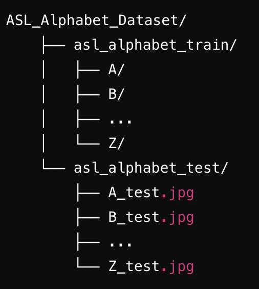

# American Sign Language (ASL) Detection Project

## Overview
This project aims to develop an application that can recognize and interpret American Sign Language (ASL) gestures using a Convolutional Neural Network (CNN) model and real-time video processing. The application uses MediaPipe for hand landmark detection and TensorFlow for building and deploying the CNN model. The project includes two main components:
1. `asl.ipynb`: A Jupyter notebook that processes the ASL alphabet dataset, trains a CNN model, and evaluates its performance. 
2. `test_app.py`: A Python script that captures live video from a webcam and uses the trained model to predict ASL gestures in real time. 

## Features
* **Real-time ASL recognition**: The application uses a webcam to capture hand gestures and predicts the corresponding ASL letter. 
* **CNN Model**: A Convolutional Neural Network (CNN) is trained on an ASL alphabet dataset to classify gestures. 
* **MediaPipe Integration**: Uses MediaPipe for efficient hand landmark detection. 

## Requirements 
* **Python 3.7+**: Ensure you have a compatible version of Python installed. 
* **Dependencies**: Install the necessary Python packages by running: `pip install opencv-python mediapipe tensorflow numpy pandas matplotlib scikit-learn tqdm`.
* **Hardware**: A webcam is required to run the real-time detection application. 

## Dataset
The project uses the **ASL Alphabet Dataset**, which includes images of ASL gestures for each letter of the alphabet. The dataset should be organized in the following structure:

Ensure the dataset is placed in the `ASL_Alphabet_Dataset` directory as described above.

## Installation
1. **Clone the repository**: `git clone https://github.com/jdanielle12/ASL_Interpreter.git` `cd ASL_Interpreter`
2. **Install the required packages**: `pip install -r requirements.txt`
3. **Download the ASL Alphabet Dataset** and organize it as shown in the dataset section. 

## Usage

### Training the Model
1. **Open** `asl.ipynb` **in Jupyter Notebook or Jupyter Lab**.
2. **Run each cell sequentially** to process the dataset, train the CNN model, and evaluate its accuracy.
3. The trained model will be saved as `asl_model_tuned.keras`.

### Running the Real-time Detection App
1. **Ensure your webcam is connected**.
2. **Run the** `test_app.py` **script**: `python test_app.py`
3. The application will open a window displaying the webcam feed. Perform ASL gestures in front of the camera, and the predicted letter will be displayed on the screen. 

### Example Usage
Here is an example of how to use the ASL Interpreter application:
* Launch the application: `python test_app.py`
* Make sure your hand is visible in the webcam feed, and perform an ASL gesture. 
  * Take note that some computers require you to not be using your webcam on any other platform while running this program.
* The application will predict the letter and display it on the video feed.

## Code Explanation
### `asl.ipynb`
* **Dependencies**: Import necessary libraries such as OpenCV, MediaPipe, TensorFlow, NumPy, and others for data preprocessing, model building, and visualization.
* **Dataset Processing**: Loads the dataset, extracts hand landmarks using MediaPipe, and stores the processed data in a pickle file. 
* **Data Preparation**: Encodes labels, splits the data into training and testing sets, and normalizes the input features.
* **Model Training**: Builds and trains a CNN model using the processed data. 
* **Model Evaluation**: Evaluates the trained model on the test dataset and daves the model for later use. 
* **NOTE: THIS PROJECT USES A VERY LARGE DATASET. THE MODEL IS ALREADY LOADED AND TRAINED FOR YOU. THEREFORE, YOU DON'T NEED TO RUN THE MODEL TO USE THIS PROGRAM UNLESS YOU PLAN ON ADDING MORE TRAINING AND TESTING DATA**

### `test_app.py`
* **Model Loading**: Loads the trained model and initalizes MediaPipe for hand detection.
* **Real-time Processing**: Captures video frames from the webcam, detects hand landmarks, and predicts ASL gestures.
* **Display**: Annotates the video feed with detected landmarks and predicted letters.

## Troubleshooting
* **Webcam Not Detected**: Ensure your webcam is properly connected and accessible. Check your system's camera settings and permissions.
* **Model Accuracy**: If the model's accuracy is low, consider increasing the training dataset size, adjusting model architecture, or tuning hyperparameters.

## Examples

## Acknowledgments
* **MediaPipe**: For providing an efficient and robust solution for hand landmark detection.
* **TensorFlow**: For enabling the development and deployment of deep learning models.
* **ASL Alphabet Dataset**: For providing a comprehensive dataset of ASL gestures.
  * Which we sourced from: `https://www.kaggle.com/datasets/debashishsau/aslamerican-sign-language-aplhabet-dataset`.  

## Contributors
* Jacqueline Columbro
* Jamie McGraner
* Anand Punwani
* Anthony Wilson
